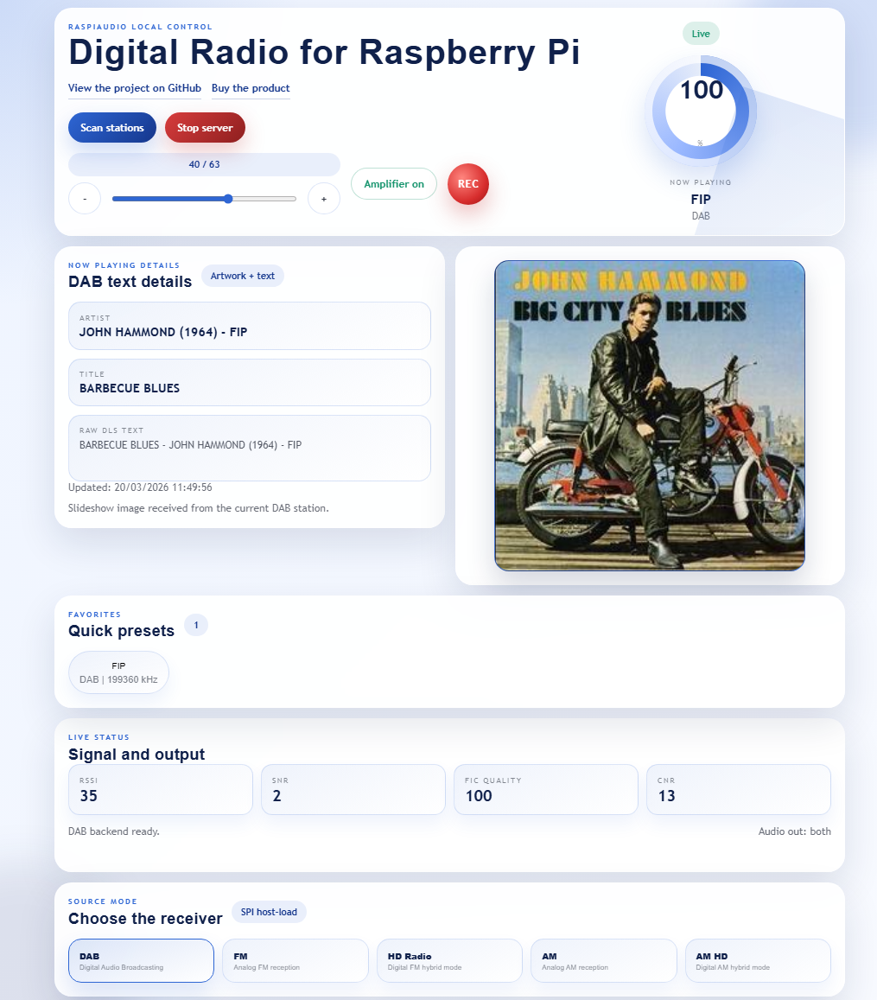
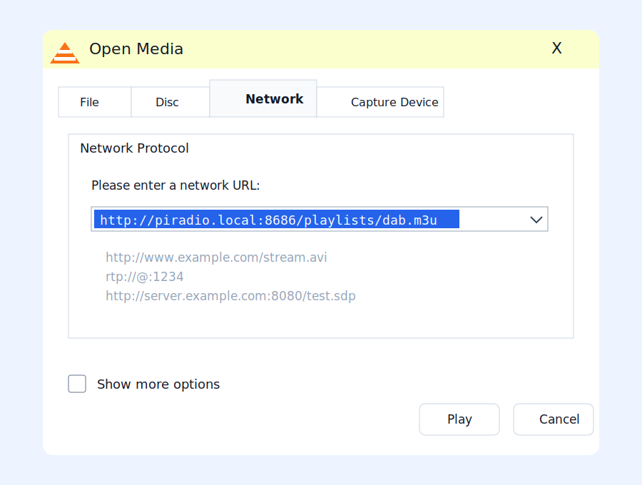
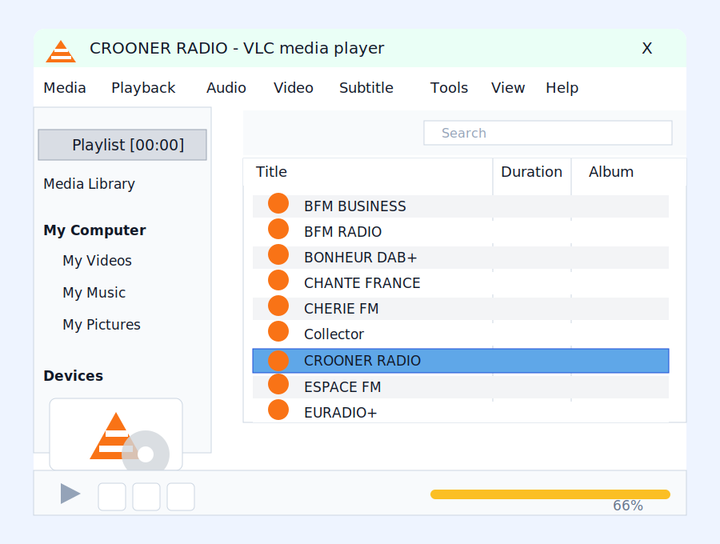

# Raspiaudio Digital Radio for Raspberry Pi

Youtube video presentation :
[](https://youtu.be/ORMRDO0aOpA)


Add this shield to a Raspberry Pi Zero, 4 or 5 to install a fully local FM, DAB, AM and HD Radio (United States) receiver in minutes, listen without internet, record audio, and control everything from a polished web UI on your local network.

The Raspiaudio Digital Radio Shield for Raspberry Pi is a compact all-in-one radio board that brings AM, FM, DAB, DAB+, and HD Radio support to Raspberry Pi boards with a 40-pin header. It combines a local Web UI, CLI control, analog audio output, I2S digital audio, a built-in 1 x 5 W amplifier, a switchable onboard speaker output, and an onboard 3-way navigation control with up, down, and push actions for standalone menu-based projects.

*HD Radio is subject to licensing. Please verify that you are legally allowed to use it in your country and for your intended application.*

<p align="center">
  
  
</p>

<p align="center">
  
</p>

The focus is simple:
- no internet required to listen to radio
- resilient local control
- browser-based Web UI for daily use
- CLI access for automation, scripting, and custom applications

The whole project is open source:
- GitHub: [RASPIAUDIOadmin/Digital-Radio-for-Raspberry-Pi](https://github.com/RASPIAUDIOadmin/Digital-Radio-for-Raspberry-Pi)
- Product: [Raspiaudio Digital Radio Shield for Raspberry Pi](https://raspiaudio.com/product/digital-radio/)
<li><a href="https://raspiaudio.com/product/digital-radio/" target="_blank" rel="noopener">Store </a></li>

## Quickstart

Because we understand that you might be busy with your job or family, here is how to have instant fun.

Clone the project:

```bash
git clone https://github.com/RASPIAUDIOadmin/Digital-Radio-for-Raspberry-Pi.git
cd Digital-Radio-for-Raspberry-Pi
```

Start the local radio server:

```bash
python radio.py serve --port 8686
```

Then open:

```text
http://piradio.local:8686/
```

If you are already on the Raspberry Pi, this is enough to get the Web UI and the CLI backend running.

## Main features

- DAB / DAB+
- FM
- HD Radio
- AM
- AM HD
- local Web UI to scan, browse, tune, change volume, manage favorites, and handle recordings
- CLI to control the backend from the terminal or integrate the radio into your own software
- direct HTTP stream URLs for VLC, a browser, Music Assistant, or any compatible network player
- analog audio output on the shield
- I2S audio path for digital capture and recording
- built-in `1 x 5 W` amplifier
- switchable onboard speaker output
- onboard 3-way navigation button: up, down, and push
- audio jack output
- screwless passive speaker output for an external speaker
  - `4 ohm` recommended
  - `8 ohm` supported
- SMA antenna connector for the included antenna or a different external antenna
- AM antenna balun for impedance matching
- AM loop antenna connection support
- amplifier enable on `GPIO17`
- local recordings list in the browser

## Why this project

Unlike an internet radio product, this setup does not depend on network streaming to play stations.

That makes it useful when you want:
- a radio that still works without internet access
- direct access to terrestrial broadcast bands
- a local control API you can reuse in your own program
- a Raspberry Pi based platform that is easy to extend

## Web UI first

The recommended workflow is the local Web UI.

It gives you:
- source mode selection
- station scan
- station selection
- favorites
- amplifier on / off
- volume control
- recording controls
- recordings browser
- a simple radio workflow directly from a browser on the local network

Start the server on the Raspberry Pi:

```bash
python radio.py serve --port 8686
```

Then open:

```text
http://piradio.local:8686/
```

## I2S recording on Raspberry Pi

If you want recording from the SI4689 I2S output, enable the Raspberry Pi capture overlay in `/boot/firmware/config.txt`:

```ini
dtparam=i2s=on
dtoverlay=adau7002-simple,card-name=si4689_i2s
```

Then reboot the Raspberry Pi.

After reboot, you should see the capture card with:

```bash
arecord -l
```

Expected result:

```text
card 2: si4689i2s [si4689_i2s], device 0: ...
```

The server now auto-detects this ALSA capture device for recordings, so the normal command stays:

```bash
python radio.py serve --port 8686
```

The default backend uses the Raspberry Pi as the I2S clock master and the SI4689 as I2S slave, which matches the Skyworks SDK example and the `adau7002-simple` capture overlay.

By default, the backend also trims the first `3` seconds of each WAV recording to remove the unstable I2S startup noise.

If needed, you can still force a device manually:

```bash
python radio.py serve --port 8686 --record-device plughw:CARD=si4689i2s,DEV=0
```

If your hardware is wired for the opposite clock direction, you can override it:

```bash
python radio.py serve --port 8686 --i2s-master
```

If you want to keep the full raw capture without trimming the first seconds:

```bash
python radio.py serve --port 8686 --record-trim-seconds 0
```

## Stream URLs and Music Assistant integration

The server can expose the shield as a live radio source for Music Assistant, VLC, a browser, or any player that can open an HTTP MP3 stream.

Stream URLs require the SI4689 I2S audio capture device to be installed on the Raspberry Pi.
The server captures `si4689_i2s` through ALSA and uses `ffmpeg` to expose MP3 streams over HTTP.
Install the I2S overlay described in [I2S recording on Raspberry Pi](#i2s-recording-on-raspberry-pi) before using `/audio/live.mp3`, station stream URLs, or generated playlists.

The important endpoints are:

```text
http://piradio.local:8686/audio/live.mp3
http://piradio.local:8686/audio/stations/<station_id>.mp3
http://piradio.local:8686/api/station-streams?mode=dab
http://piradio.local:8686/playlists/dab.m3u
http://piradio.local:8686/playlists/favorites.m3u
http://piradio.local:8686/api/live-metadata
```

How it works:

- `/audio/live.mp3`
  streams the currently tuned station
- `/audio/stations/<station_id>.mp3`
  retunes the hardware to the requested station and streams it
- `/api/station-streams?mode=dab`
  returns the available DAB stations with ready-to-use stream URLs
- `/playlists/dab.m3u`
  exports all DAB stations as a playlist
- `/playlists/favorites.m3u`
  exports only favorites
- `/api/live-metadata`
  returns the current DAB now-playing text and artwork URL as JSON

### Use your usual player instead of the Web UI

You do not have to use the Raspiaudio Web UI if you prefer your usual player.

For a quick test, paste the live stream URL directly into a browser:

```text
http://piradio.local:8686/audio/live.mp3
```

For a station browser, open the generated DAB playlist in VLC with `Media` -> `Open Network Stream`:

```text
http://piradio.local:8686/playlists/dab.m3u
```

If your network does not resolve `piradio.local`, use the Raspberry Pi IP address instead, for example:

```text
http://192.168.1.154:8686/playlists/dab.m3u
```

VLC will display the stations from the playlist. Selecting another item retunes the Raspberry Pi service to that station, so you can switch between DAB stations from VLC without opening the Web UI.

<p align="center">
  
  
</p>

Important limitation:

- the shield is a single hardware tuner
- starting a different station retunes the hardware for everyone

### Add the live source to Music Assistant

The simplest approach is to add the station URLs to the Builtin provider in Music Assistant.

For example:

```text
http://piradio.local:8686/audio/stations/dab%3A0000f21b%3A00000001%3A195936.mp3
```

Or import the generated playlist:

```text
http://piradio.local:8686/playlists/dab.m3u
```

Once imported, Music Assistant can redistribute that terrestrial radio source to all supported players on the network.

### Live metadata in the MP3 stream

When a client requests ICY metadata, the live stream injects:

- station name in the ICY headers
- current DAB text as `StreamTitle`
- current DAB artwork URL as `StreamUrl` when the multiplex provides MOT artwork

This works especially well with Music Assistant because it reads ICY `StreamTitle` from radio streams and can surface the current song in the UI and on compatible players.

Note:

- Music Assistant reliably consumes `StreamTitle`
- artwork handling depends on the downstream client and current Music Assistant support for the source type

Example:

```text
StreamTitle='THE WEEKND - In Your Eyes';
StreamUrl='http://piradio.local:8686/api/dab/artwork?ts=...';
```

## CLI mode

The CLI uses the same backend as the Web UI.

That means you can control the radio manually from the terminal, or use the commands as a base for your own scripts and applications.

### Simple interactive CLI workflow

Open a first terminal on the Raspberry Pi and start the local backend:

```bash
python radio.py serve --port 8686
```

Then keep a second terminal open and send commands interactively, one by one:

```bash
python radio.py status
python radio.py stations --mode dab
python radio.py play 0
python radio.py volume 31
python radio.py volume +2
python radio.py amp on
python radio.py record start
python radio.py record stop
python radio.py recordings
```

Useful examples:

```bash
python radio.py boot --mode dab
python radio.py scan --mode fm
python radio.py stations --mode fm
python radio.py play AIRZEN RADIO
python radio.py play dab:0000f204:00000009:199360
python radio.py favorite 0
```

To see all available commands:

```bash
python radio.py --help
```

## Repository layout

- `radio.py`
  entry point for the CLI
- `raspiaudio_radio/`
  shared backend, HTTP server, and Web UI
- `firmwares/`
  firmware and patch files used by the radio backend
- `legacy/`
  older low-level scripts kept for reference

## Current backend scope

The current radio backend is intentionally kept simple:
- SPI control
- local firmware host-load
- Web UI + CLI on the same backend
- station playback
- favorites
- local browser control
- I2S recording workflow

## Flash boot notes

Boot from external flash is now validated on the Raspberry Pi with the SI4689.

In practice, flash boot is especially interesting when the host talks to the tuner over a slower control link such as I2C. With fast SPI host-load, the gain is smaller, because SPI host-load is already quite fast. With I2C, flash boot should save much more startup time.

Validated flash programming sequence:
- host-load `rom00_patch.016.bin`
- erase chip with `0x05 0xFF 0xDE 0xC0`
- write flash using `FLASH_WRITE_BLOCK` `0x05 0xF0 0x0C 0xED ...`

Validated flash boot sequence:
- host-load `rom00_patch_mini.003.bin`
- send `LOAD_INIT`
- `FLASH_LOAD` the full patch from `0x00004000`
- send `LOAD_INIT`
- `FLASH_LOAD` the DAB firmware from `0x00092000`
- send `BOOT`

Program the external flash from the normal CLI:

```bash
python radio.py flash dab
```

Start the web server by booting the firmware from flash:

```bash
python radio.py serve --port 8686 --boot-source flash
```

You can also ask the server to try flash first and fall back to normal SPI host-load if flash boot fails:

```bash
python radio.py serve --port 8686 --boot-source auto
```

Validation method:
- tune to DAB multiplex `199360 kHz`
- wait for `acq=true` and `valid=true`
- confirm that the service list is readable after boot

Benchmark measured on the Raspberry Pi on DAB `199360 kHz`, from reset to a valid DAB lock (`acq=true`, `valid=true`):

| Control speed | Host-load over SPI | Flash boot mini | Flash boot full |
| --- | ---: | ---: | ---: |
| `30 MHz` | `2.37 s` | `1.14 s` | `2.40 s` |
| `1 MHz` | `7.10 s` | `1.07 s` | `1.00 s` |
| `500 kHz` | `12.57 s` | `1.16 s` | `0.99 s` |

So, with the default fast SPI setup, host-load is already usable. The flash path becomes much more compelling when the host side is intentionally slowed down for debug, or when using a slower control interface such as I2C.

## Hardware notes

Current shield-oriented defaults:
- `RSTB = BCM25`
- `AMP_EN = BCM17`
- `SPI bus/device = 0/0`
- local firmware files loaded from `firmwares/`
- onboard navigation input with `up / down / push`
- onboard speaker output with dedicated on / off control
- SMA antenna connector
- AM impedance-matching balun
- passive speaker connector

## Dependencies

On Raspberry Pi OS:

```bash
sudo apt install python3-spidev python3-rpi.gpio python3-smbus2 alsa-utils ffmpeg
```

## Open source and reusable

This repository is not only a radio player.

It is also a base to:
- build your own radio application
- integrate the SI4689 shield into a custom Raspberry Pi project
- create your own UI on top of the CLI or HTTP backend
- experiment with local digital radio features without depending on cloud services

## Inputs / Outputs

- Power input:
  - `5V` on Raspberry Pi header pins `2` and `4`
  - `GND` on pins `6, 9, 14, 20, 25, 30, 34, 39`
- SPI radio interface:
  - `MOSI` on `GPIO10` / pin `19`
  - `MISO` on `GPIO9` / pin `21`
  - `SPICLK` on `GPIO11` / pin `23`
  - `SSBSI` on `GPIO8` / pin `24`
- Radio control:
  - `INT` on `GPIO23` / pin `16`
  - `SI4689 RST` on `GPIO25` / pin `22`
  - `ENABLE_AMPLI` on `GPIO17` / pin `11`
- I2S digital audio:
  - `I2S BCK` on `GPIO18` / pin `12`
  - `I2S LRCK` on `GPIO19` / pin `35`
  - `I2S DOUT` on `GPIO20` / pin `38`
- Navigation button:
  - `Switch CW` on `GPIO5` / pin `29`
  - `Switch PUSH` on `GPIO6` / pin `31`
  - `Switch CCW` on `GPIO13` / pin `33`
- RF and audio connections on the shield:
  - `SMA` antenna connector
  - AM loop antenna input
  - AM impedance-matching balun
  - audio jack output
  - onboard speaker output with on / off switch
  - passive external speaker output via screwless connector
