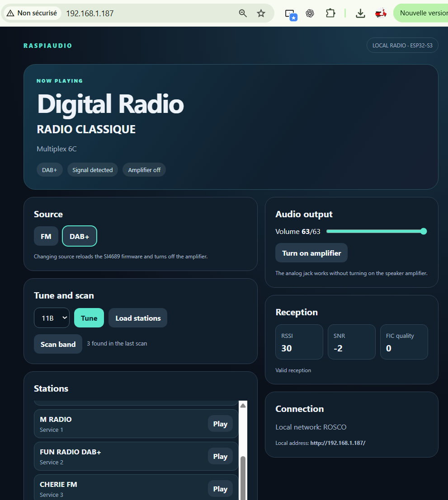

# Local web controls

The `zerocore_s3_web` PlatformIO environment builds a lightweight local web
interface for the Digital Radio shield. It uses the same SI4689 control code
and analog audio path as the serial version. The Raspberry Pi backend and web
UI remain the full-featured application; this ESP32-S3 page needs no Internet
connection or external assets. It can use a local Wi-Fi network or its own
hotspot.

## Connect

1. Build with `pio run -e zerocore_s3_web` and flash the resulting firmware.
   For a generic ESP32-S3 board with 8 MB flash, use `generic_s3_web` and
   adjust the GPIO build flags as described in the [main guide](README.md).
2. Open the USB serial monitor at 115200 baud. Send `wifi` to see the current
   network mode and address.
3. With no saved network, join the `RASPIAUDIO-Radio-XXXXXX` hotspot. The
   default password is `raspiaudio`. Open **http://192.168.4.1/**.
4. Optionally, enter a local network SSID and password in the **Connection**
   card. The device stores them in its flash and tries that network on every
   boot. Use its local IP reported by `wifi` (or the displayed mDNS hostname).
   If connection fails after 30 seconds, or an established link stays down for
   10 seconds, the hotspot returns. The saved credentials remain in flash so
   the device tries again on its next boot.

You can also configure a local network over USB serial with
`wifi set <ssid> <password>`, retry saved credentials with `wifi retry`, or
remove them with `wifi clear`. SSIDs containing
spaces are not supported by this serial command; use the web form instead.
`wifi clear` remains available over serial while the device is on the local
network. The web form only changes credentials from the hotspot. On ZeroCore
S3, settings use the dedicated `radio_cfg` flash partition; generic ESP32-S3
builds use NVS. Passwords
are never included in the HTTP status response or serial network status.
Keep local Wi-Fi credentials out of source files and PlatformIO build flags.

To set a different hotspot password, add
`-DRADIO_AP_PASSWORD=\"your-password\"` to the environment's `build_flags`.
WPA2 requires at least eight characters. Use a unique password for a device
outside the workbench. The hotspot exposes radio controls to connected clients.

## Controls

- Switch between FM and DAB+. The SI4689 firmware reloads and the speaker
  amplifier turns off during a mode change.
- Tune an FM frequency or a DAB Band III channel. After tuning DAB, use
  **Load stations** to read the services and select one to play.
- Start a nonblocking scan of the current band. FM scan results are frequencies;
  DAB scan results are multiplex channels. A DAB scan can take several minutes.
  Scanning interrupts current audio. Choose a result afterwards to resume.
- Adjust SI4689 analog volume from 0 to 63 and toggle the shield amplifier.
- View live reception metrics and scan progress.

Audio plays through the shield's analog jack or speaker output. This lite
version does not stream audio to the browser, record audio, show metadata or
offer the Raspberry Pi application's advanced settings. Serial commands stay
available in the web build.

## Local HTTP API

The page uses these routes. Mutating routes accept form-encoded POST data and
return JSON with `ok` or an `error` message.

| Route | Method | Data |
| --- | --- | --- |
| `/api/status` | GET | Radio state, metrics, scan progress and lists |
| `/api/channels` | GET | Band III channel names |
| `/api/mode` | POST | `mode=fm` or `mode=dab` |
| `/api/tune` | POST | `frequency=101.10` (FM) or `channel=11B` (DAB) |
| `/api/services` | POST | Read the tuned DAB multiplex's service list |
| `/api/play` | POST | `index=1` from the most recent service list |
| `/api/volume` | POST | `value=0` through `63` |
| `/api/amp` | POST | `on=0` or `on=1` |
| `/api/scan` | POST | Start a scan in the current mode |
| `/api/wifi` | POST | From hotspot: `ssid` and `password`; save on the device, then connect |
| `/api/wifi/clear` | POST | From hotspot: erase saved credentials |
| `/api/wifi/retry` | POST | From hotspot: retry saved credentials |

The hotspot is local to the device. When connected, a phone may report that
the network has no Internet access; keep the connection and use the local IP.
